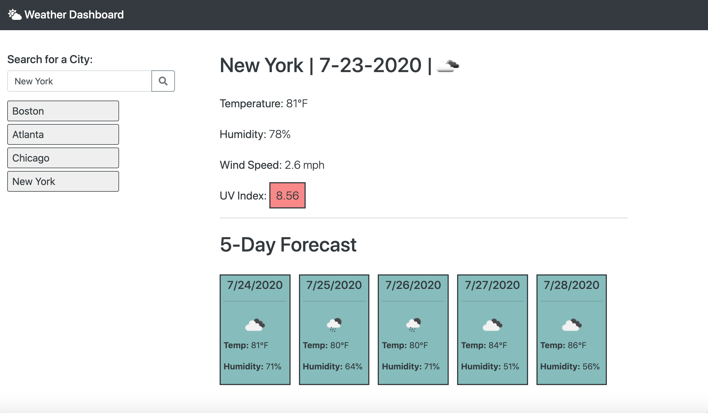

# Weather-Dashboard
Weather-Dashboard is an interactive application that utilizes server-side APIs to display real-time weather data across thousands of cities.

## Description
Upon entering the applciation, users are greeted with a polished weather dashboard featuring a city search field and weather descriptions with empty data fields. 

Once the user inputs a city name into the search box, weather data is projected next to the corresponding descriptors. The top portion of the weather dashboard displays current weather data, whereas the bottom half of the dashboard features a 5-day forecast. Below is a breakdown of the specific data featured on the site.

Current Weather Tracks:
    1. Temperature
    2. Humidity
    3. Wind Speed
    4. UV Index

5-Day Forecast Tracks:
    1. Date
    2. Temperature
    3. Humidity

Lastly, users have the ability to enter as many cities as they so choose and click on formerly searched cities to re-display city-specific weather data.

## Visuals

## Link to Deployed Application
https://barrettpope.github.io/Weather-Dashboard/

## Support
For questions, comments or concerns regarding the Weather-Dashboard application, please email barrettpope94@gmail.com.

## Contributing
Pull requests are welcome.